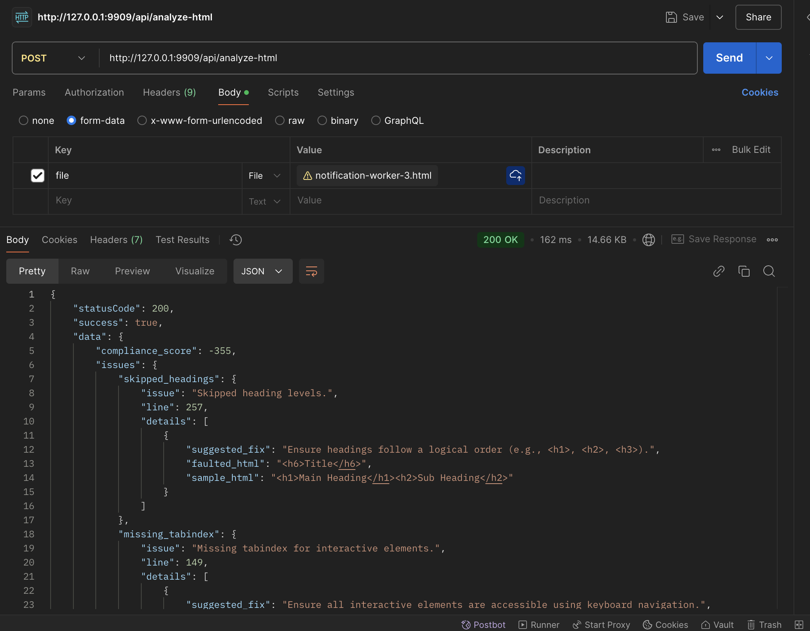

## About this repository

WCAG stands for Web Content Accessibility Guidelines. In simple terms, it's a set of rules that help make websites easier to use for people with disabilities, like those who are blind, deaf, or have difficulty using a mouse. These guidelines ensure that websites are accessible to everyone, no matter their abilities.

This API application features the following:

- Accept an HTML file upload.
- Analyze accessibility issues (e.g., `missing alt attributes`, `skipped heading levels`) using a rule-based algorithm.
- Return a JSON response with a compliance score and suggested fixes.

## Environment Setup

1. CD into the application root directory with your command prompt/terminal/git bash.
2. Run `cp .env.example .env` command to create a local environment configuration file.
3. Inside the `.env` file, setup database, mail and other configurations for `production` (optional for this project).
4. Run `composer install` to install the project dependencies in the `composer.json` file.
5. Run `php artisan key:generate` command to generates the application key.
6. Run `php artisan serve` or `php artisan serve --port=PORT_NUMBER` command to start a local development server.
7. Define additional routes in the `routes/api.php` file.
8. Run `composer dump-autoload` to generate new optimized autoload files (optional).

## Running Tests
To run the test suite and ensure everything is working as expected, follow these steps:

1. Install PHPUnit (if you don't already have it): `composer require --dev phpunit/phpunit`
2. Run the tests: Run the following command to execute all the tests, including the `AccessibilityServiceTest`: `php artisan test` or `vendor/bin/phpunit`
3. Running a specific test: If you want to run the `AccessibilityServiceTest` specifically, you can use the following command: `vendor/bin/phpunit --filter AccessibilityServiceTest`
4. Check test results: After running the tests, PHPUnit will output the test results in the terminal. Look for the section where the tests for the `AccessibilityServiceTest` class are listed to ensure all tests pass.

## Project Test Results

```
   PASS  AccessibilityServiceTest
  ✓ it detects missing alt attribute                                                                                      0.01s  
  ✓ it detects skipped heading levels
  ✓ it detects missing tabindex for interactive elements
  ✓ it detects missing labels for form fields
  ✓ it detects missing skip navigation link
  ✓ it detects font size too small
  ✓ it detects broken links
  ✓ it detects missing input labels

  Tests:    8 passed (31 assertions)
  Duration: 0.07s
```

## Project Screenshots


